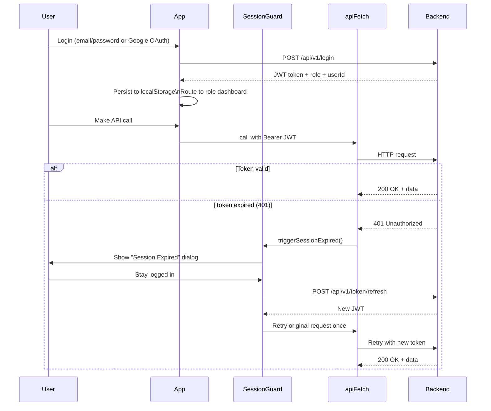
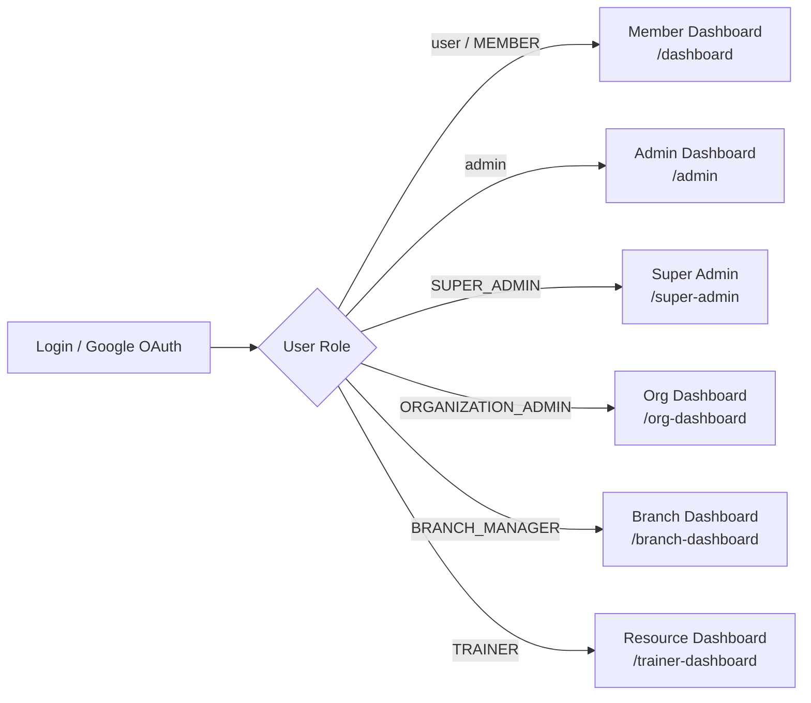
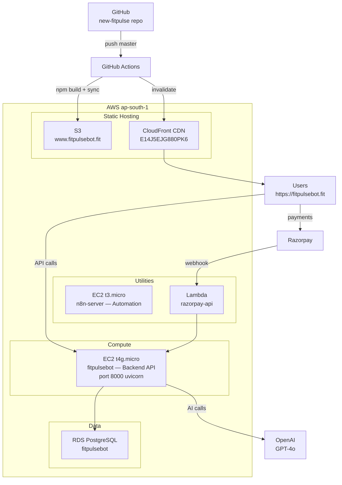
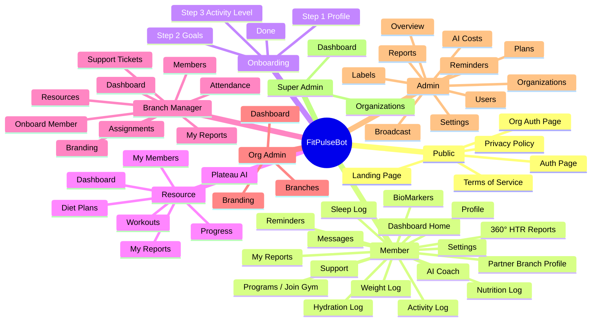
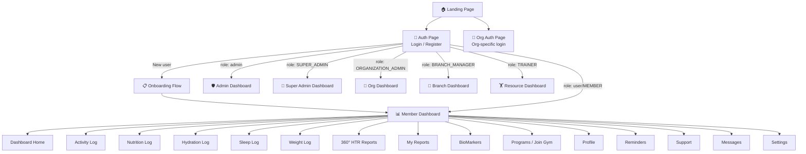

# FitPulseBot — Frontend

> AI-powered fitness tracking web app — React 19 + TypeScript frontend

## Tech Stack

| Layer | Technology |
|---|---|
| Framework | React 19 + TypeScript |
| Bundler | Create React App (react-scripts 5) |
| Styling | CSS Modules |
| Animations | Framer Motion |
| Charts | Recharts |
| Icons | Lucide React |
| Auth | JWT (localStorage) + Google OAuth (`@react-oauth/google`) |
| HTTP | Custom `apiFetch` helper with auto token injection + session guard |
| Backend | FastAPI (port 8000) — see FitPulseBot-backend repo |

---

## Project Structure

```
new-fitpulse/
├── public/                   # Static assets, favicon, PWA manifest
├── src/
│   ├── api.ts                # Centralised API client (apiFetch, apiFetchAI, api.*)
│   ├── App.tsx               # Root router + auth context wiring
│   ├── components/           # Feature components (logging, sections, dashboards)
│   │   ├── SessionGuard.tsx  # Token refresh / session-expired dialog
│   │   ├── DashboardHome.tsx # Main user dashboard
│   │   ├── PortalLayout.tsx  # Shared sidebar/nav layout
│   │   ├── ImageUploadLogger.tsx  # AI-powered image-to-log (food/water/activity)
│   │   ├── NutritionLog.tsx  # Food intake logging
│   │   ├── HydrationLog.tsx  # Water intake logging
│   │   ├── ActivityLog.tsx   # Activity/workout logging
│   │   ├── WeightLog.tsx     # Weight tracking
│   │   ├── SleepLog.tsx      # Sleep logging
│   │   ├── BioMarkersPage.tsx # Lab report upload & biomarker tracking
│   │   ├── AdminJsonReportView.tsx  # Admin report renderer
│   │   ├── SubscriptionPage.tsx     # Plan selection + Razorpay checkout
│   │   └── ...               # 40+ more components
│   ├── pages/                # Top-level route pages
│   │   ├── LandingPage.tsx
│   │   ├── AuthPage.tsx      # Login / Register
│   │   ├── Dashboard.tsx     # Member dashboard shell
│   │   ├── AdminDashboard.tsx
│   │   ├── TrainerDashboard.tsx
│   │   ├── OrgDashboard.tsx
│   │   ├── BranchDashboard.tsx
│   │   ├── SuperAdminDashboard.tsx
│   │   └── OnboardingFlow.tsx
│   ├── contexts/             # React contexts (auth, theme, etc.)
│   ├── config/               # App-level config constants
│   ├── themes/               # Theme tokens / CSS variables
│   └── utils/                # Helper utilities
├── .env                      # Environment variables (see below)
├── tsconfig.json
└── package.json
```

---

## Prerequisites

- Node.js ≥ 18
- npm ≥ 9
- FitPulseBot backend running on port 8000

---

## Environment Variables

Create a `.env` file in the project root (already present, **do not commit**):

```env
REACT_APP_API_BASE_URL=http://localhost:8000
REACT_APP_GOOGLE_CLIENT_ID=<your-google-oauth-client-id>
```

| Variable | Description |
|---|---|
| `REACT_APP_API_BASE_URL` | Base URL of the FastAPI backend |
| `REACT_APP_GOOGLE_CLIENT_ID` | Google OAuth client ID for social login |

---

## Setup & Run

### 1. Install dependencies

```bash
cd /Users/sanjay82/Documents/GITHUB/new-fitpulse
npm install
```

### 2. Start the backend first

```bash
cd /Users/sanjay82/Documents/All-development/fitpulsebot-website/FitPulseBot-backend
uvicorn main:app --reload --port 8000
```

### 3. Start the frontend dev server

```bash
npm start
```

Opens at **http://localhost:3000**

---

## Available Scripts

| Command | Description |
|---|---|
| `npm start` | Start dev server with hot reload (port 3000) |
| `npm run build` | Production build to `/build` |
| `npm test` | Run Jest tests in interactive watch mode |
| `npm run eject` | Eject CRA config (irreversible) |

---

## API Architecture

All backend communication goes through `src/api.ts`:

- **`apiFetch(path, options)`** — calls `/api/v1/*`, auto-injects `Bearer` token, handles 401 → session refresh dialog → single retry
- **`apiFetchAI(path, options)`** — calls `/api/ai/v1/*` (AI endpoints)
- **`apiAiUpload(endpoint, formData)`** — multipart upload for image-based logging
- **`api.*`** — namespaced API objects: `api.auth`, `api.food`, `api.water`, `api.activity`, `api.weight`, `api.sleep`, `api.dashboard`, `api.admin`, `api.trainer`, `api.ai`, `api.plans`, `api.subscription`, `api.support`, `api.branch`, `api.org`, `api.superAdmin`, etc.

---

## Key Features

- **Member Dashboard** — daily goals, nutrition, hydration, activity, weight & sleep sections
- **AI Image Logging** — GPT-4o Vision identifies food/water/activity from photos
- **Google OAuth** — social login via `@react-oauth/google`
- **Session Guard** — auto token refresh with session-expired dialog
- **Multi-role Dashboards** — Member, Resource, Admin, Org Manager, Branch Manager, Super Admin
- **Subscription & Billing** — plan selection with Razorpay checkout
- **Reports** — scheduled and on-demand reports with PDF export
- **Biomarkers** — PDF lab report upload + AI extraction
- **Gym/Partner Join Flow** — request to join partner gym branches
- **UI Labels** — per-org/branch white-label text customisation
- **Reminders** — configurable notification catalogue per org

---

## Production Build

```bash
npm run build
```

Output goes to `/build`. Serve statically via nginx or S3 + CloudFront.

---

## Related Repositories

| Repo | Description |
|---|---|
| `FitPulseBot-backend` | FastAPI + PostgreSQL (AWS RDS) backend — port 8000 |
| `new-fitpulse` | This repo — React frontend — port 3000 |


---

## Architecture

### High-Level System Architecture

```mermaid
graph TB
    subgraph Client["🌐 Client (Browser)"]
        UI[React 19 + TypeScript SPA]
        CTX[AppContext — Auth / Theme / Page]
        API_CLIENT[api.ts — apiFetch / apiFetchAI]
    end

    subgraph Auth["🔐 Auth Layer"]
        GOOGLE[Google OAuth 2.0]
        JWT[JWT — localStorage]
        SESSION[SessionGuard — token refresh]
    end

    subgraph CDN["☁️ CDN / Hosting (AWS)"]
        CF[CloudFront\nDistribution E14J5EJG880PK6]
        S3[S3 Bucket\nwww.fitpulsebot.fit\nap-south-1]
    end

    subgraph Backend["⚙️ Backend (FastAPI — port 8000)"]
        V1[/api/v1/* — Core REST]
        AI_V1[/api/ai/v1/* — AI Endpoints]
        DB[(PostgreSQL\nAWS RDS\nap-south-1)]
    end

    subgraph AI["🤖 AI Services"]
        GPT4O[GPT-4o Vision\nFood / Water / Activity Image Logging]
        AICOACH[AI Coach Insights]
    end

    subgraph Payments["💳 Payments"]
        RAZORPAY[Razorpay\nSubscription Checkout]
    end

    UI --> CTX
    CTX --> API_CLIENT
    API_CLIENT -->|Bearer JWT| V1
    API_CLIENT -->|Bearer JWT| AI_V1
    UI --> GOOGLE
    GOOGLE -->|credential| V1
    V1 --> DB
    AI_V1 --> GPT4O
    AI_V1 --> AICOACH
    UI --> RAZORPAY
    S3 --> CF
    CF -->|HTTPS fitpulsebot.fit| UI
```

---

### Frontend Component Architecture

```mermaid
graph TD
    APP[App.tsx\nAppContext Provider\nRoute Controller]

    APP --> LANDING[LandingPage]
    APP --> AUTH[AuthPage\nLogin / Register / Google OAuth]
    APP --> ORGAUTH[OrgAuthPage]
    APP --> ONBOARD[OnboardingFlow]
    APP --> SESSION[SessionGuard\nToken Refresh Dialog]

    APP --> DASH[Dashboard — MEMBER]
    APP --> ADMIN[AdminDashboard]
    APP --> TRAINER[ResourceDashboard]
    APP --> ORG[OrgDashboard]
    APP --> BRANCH[BranchDashboard]
    APP --> SUPER[SuperAdminDashboard]

    DASH --> PORTAL[PortalLayout\nSidebar + Nav]
    PORTAL --> HOME[DashboardHome\nToday Snapshot]
    PORTAL --> NUTR[NutritionSection + NutritionLog]
    PORTAL --> HYDR[HydrationSection + HydrationLog]
    PORTAL --> ACT[ActivitySection + ActivityLog]
    PORTAL --> WEIGHT[WeightSection + WeightLog]
    PORTAL --> SLEEP[SleepSection + SleepLog]
    PORTAL --> GOALS[GoalsSection]
    PORTAL --> IMGLOG[ImageUploadLogger\nAI-powered photo → log]
    PORTAL --> AICOACH[AICoachSection]
    PORTAL --> BIO[BioMarkersPage\nLab report upload]
    PORTAL --> REPORTS[ReportsPage + MyReportsPage]
    PORTAL --> SUB[SubscriptionPage\nRazorpay checkout]
    PORTAL --> SUPPORT[SupportPage]
    PORTAL --> NOTIF[NotificationsPage]
    PORTAL --> MSGS[MessagesPage]
    PORTAL --> PROFILE[UserProfilePage]
    PORTAL --> SETTINGS[SettingsPageFull]
```



---

### Auth & Session Flow



---

### Role-Based Routing



---

## Deployment Strategy

### Overview

The frontend is deployed as a **static SPA** to AWS S3, served globally via **CloudFront CDN** with separate cache policies for hashed assets vs the app shell.

```mermaid
flowchart LR
    DEV[Developer\npush to master] --> GHA[GitHub Actions\ndeploy-s3.yml]

    subgraph GHA_STEPS["GitHub Actions Pipeline"]
        CHECKOUT[1. Checkout code]
        NODE[2. Setup Node 20\nnpm ci]
        BUILD[3. npm run build\nCRA production bundle]
        CREDS[4. Configure AWS credentials\nap-south-1]
        S3_STATIC[5. Sync build/static → S3\ncache-control: immutable 1yr]
        S3_SHELL[6. Sync app shell → S3\ncache-control: no-cache]
        CF_INVAL[7. Invalidate CloudFront /*]
    end

    GHA --> CHECKOUT --> NODE --> BUILD --> CREDS --> S3_STATIC --> S3_SHELL --> CF_INVAL

    CF_INVAL --> CF[CloudFront\nE14J5EJG880PK6]
    CF --> USERS[End Users\nhttps://fitpulsebot.fit]
```



### Cache Strategy

| Asset Type | S3 Path | Cache-Control | TTL |
|---|---|---|---|
| JS / CSS bundles | `build/static/` | `public, max-age=31536000, immutable` | 1 year |
| `index.html` + app shell | `build/` (root) | `public, max-age=0, must-revalidate` | Always fresh |
| Images / icons | `build/static/media/` | `public, max-age=31536000, immutable` | 1 year |

Hashed filenames (`main.abc123.js`) allow **safe long-term caching** of static assets while `index.html` is always fetched fresh, guaranteeing users get the latest code on every deploy.

### CloudFront Invalidation

Every deploy triggers a `/*` invalidation on distribution **E14J5EJG880PK6**, ensuring the fresh `index.html` propagates to all edge locations immediately.

### Environment Configuration

| Environment | API Base URL | Notes |
|---|---|---|
| **Local dev** | `http://localhost:8000` | Default in `.env` |
| **Production** | `https://api.fitpulsebot.fit` | Uncomment in `.env` or set as GitHub Secret |

### Required GitHub Secrets

| Secret | Description |
|---|---|
| `AWS_ACCESS_KEY_ID` | IAM user with S3 write + CloudFront invalidation access |
| `AWS_SECRET_ACCESS_KEY` | Corresponding secret key |

### Trigger

Deployments fire automatically on every push to **`master`** branch, or manually via **workflow_dispatch** in the GitHub Actions UI. Concurrent deployments are prevented via `concurrency: cancel-in-progress: true`.

### Full Infra Overview




---

## Screens & Purpose

### Screen Map



---

### Screen Navigation Flow



---

### Screens — Detailed Reference

#### 🌐 Public Screens

| Screen | File | Purpose |
|---|---|---|
| **Landing Page** | `pages/LandingPage.tsx` | Marketing homepage — features, pricing plans (Start/Pro/Elite), testimonials, stats, CTA to login or register |
| **Auth Page** | `pages/AuthPage.tsx` | Unified login + register + forgot/reset password. Supports email/password and Google OAuth social login |
| **Org Auth Page** | `pages/OrgAuthPage.tsx` | Dedicated login portal for Org Admins and Branch Managers via organisation-specific URL |
| **Privacy Policy** | `pages/PrivacyPolicy.tsx` | Static legal page — app privacy policy |
| **Terms of Service** | `pages/TermsOfService.tsx` | Static legal page — terms and conditions |

---

#### 📋 Onboarding

| Screen | File | Purpose |
|---|---|---|
| **Onboarding Flow** | `pages/OnboardingFlow.tsx` | 4-step wizard shown to new users after first registration: (1) Profile — name/age/weight/height/gender, (2) Goals — multi-select fitness goals, (3) Activity Level — sedentary → very active, (4) Done — saves profile to API and routes to dashboard |

---

#### 👤 Member Dashboard Screens

All sections live inside `pages/Dashboard.tsx` (sidebar nav) and render their respective component.

| Screen | Component | Nav Label | Purpose |
|---|---|---|---|
| **Dashboard Home** | `DashboardHome.tsx` | Dashboard | Today's snapshot — counters (calories, water, steps, sleep, weight), AI coach insight card, goal progress rings, quick-log shortcuts |
| **Activity Log** | `ActivityLog.tsx` | Activity | Log workouts and physical activities; view daily activity history; AI image-to-activity logging via `ImageUploadLogger` |
| **Nutrition Log** | `NutritionLog.tsx` | Nutrition | Manual food entry with macro breakdown (calories, protein, carbs, fat); AI photo recognition via `ImageUploadLogger`; daily intake summary |
| **Hydration Log** | `HydrationLog.tsx` | Hydration | Log water and other drinks; daily target progress bar; average intake over 7 days; AI image logging |
| **Sleep Log** | `SleepLog.tsx` | Sleep | Log sleep start/end time and quality; duration calculation; weekly sleep trend; average hours |
| **Weight Log** | `WeightLog.tsx` | Weight | Daily weight entries; trend chart; BMI indicator; 30-day average; goal weight tracking |
| **360° HTR Reports** | `ReportsPage.tsx` | 360° HTR | Browse the report catalogue; generate on-demand health trend reports by date range; schedule recurring reports with email delivery |
| **My Reports** | `MyReportsPage.tsx` | My Reports | View past generated reports; open/download PDF; view rendered JSON report cards |
| **BioMarkers** | `BioMarkersPage.tsx` | BioMarkers | Upload PDF lab reports; AI extraction of blood biomarkers (HbA1c, cholesterol, glucose, etc.); historical biomarker trends |
| **AI Coach** | `AICoachSection.tsx` | *(DashboardHome)* | Personalised AI-generated health insight card using GPT-4o — surfaced on the dashboard home |
| **Programs / Join Gym** | `JoinGymPage.tsx` | Programs | Browse partner gyms and fitness branches; send join request; view request status |
| **Partner Branch Profile** | `PartnerBranchProfile.tsx` | *(from Programs)* | Detailed profile of a partner gym branch — resources, workout sessions, schedule |
| **Profile** | `UserProfilePage.tsx` | Profile | Edit personal details, upload profile picture, manage fitness goals, set target weight, update preferences |
| **Reminders** | `NotificationsPage.tsx` | Reminders | Enable/disable push notifications by type (water reminders, goal alerts, weekly reports, etc.) per subscription plan |
| **Support** | `SupportPage.tsx` | Support | Raise support tickets, add messages to open tickets, view ticket history and status; close resolved tickets |
| **Messages** | `MessagesPage.tsx` | Messages | In-app inbox — messages from resources, admins, and the system; mark as read |
| **Settings** | `SettingsPageFull.tsx` | Settings | App preferences — theme toggle, account security, subscription details, linked accounts, danger zone (account deletion) |
| **Subscription / Upgrade** | `SubscriptionPage.tsx` | *(from Settings/banner)* | Plan comparison table; Razorpay payment checkout; order history; current plan status |

---

#### 🏋️ Resource Dashboard Screens

All screens inside `pages/TrainerDashboard.tsx`.

| Screen | Nav Label | Purpose |
|---|---|---|
| **Dashboard** | Dashboard | Overview — assigned member count, active plans, recent activity feed |
| **My Members** | My Members | List of assigned members with progress status badges; drill into individual member detail |
| **Workouts** | Workouts | Create, view, edit, delete and schedule workout plans for members; AI workout generation |
| **Diet Plans** | Diet Plans | Create and manage personalised diet plans; AI macro calculator and meal alternatives |
| **Plateau AI** | Plateau AI | AI-powered plateau detection dashboard — identifies members who have stalled in progress and suggests optimisations |
| **Progress** | Progress | Comprehensive member progress view — overview, workouts, diet, measurements, body composition, health logs, attendance, photos, resource notes |
| **My Reports** | My Reports | Resource-scoped reports — member trends, workout adherence, nutrition compliance |

---

#### 🔀 Branch Manager Dashboard Screens

All screens inside `pages/BranchDashboard.tsx`.

| Screen | Nav Label | Purpose |
|---|---|---|
| **Dashboard** | Dashboard | Branch KPIs — member count, active resources, attendance rate, revenue summary |
| **Onboard Member** | Onboard Member | Create new member accounts directly within the branch |
| **Members** | Members | Full member list — search, filter by status; update member details or deactivate |
| **Resources** | Resources | Resource roster for the branch; add/remove resources |
| **Assignments** | Assignments | Assign and unassign resource–member pairs |
| **Attendance** | Attendance | Mark and view daily attendance; edit attendance records |
| **Support Tickets** | Support | View all open support tickets raised by branch members |
| **My Reports** | My Reports | Branch-scoped reports — attendance trends, member health summaries |
| **Branding** | Branding | White-label customisation — logo, colours, typography for the branch portal |

---

#### 🏢 Organisation Admin Dashboard Screens

All screens inside `pages/OrgDashboard.tsx`.

| Screen | Nav Label | Purpose |
|---|---|---|
| **Dashboard** | Dashboard | Organisation-level KPIs — total branches, members, resources, revenue |
| **Branches** | Branches | Create, view, and manage branches under the organisation; view per-branch detail panel |
| **Branding** | Branding | Organisation-wide white-label settings — logo, theme, custom labels |

---

#### 🛡️ Admin Dashboard Screens

All screens inside `pages/AdminDashboard.tsx`.

| Screen | Nav Label | Purpose |
|---|---|---|
| **Overview** | Overview | Platform-wide metrics — total users, DAU, new signups, revenue charts (Recharts area + bar + pie) |
| **Organizations** | Organizations | List and manage all organisations on the platform; delegated to SuperAdminDashboard component |
| **Users** | Users | Paginated user list with role/plan/status filters; update user status (active / inactive / banned) |
| **AI Costs** | AI Costs | Log and review all AI API cost entries — input/output tokens, cost in $ and ₹, per-user AI credit usage |
| **Reports** | Reports | Admin-scoped report catalogue; generate and view platform health reports |
| **Plans** | Plans | Full plan CRUD — create/edit/delete subscription plans; schema-dynamic field management via `/admin/schema/plan`; plan limits management |
| **Labels** | Labels | UI label internationalisation — per-org/branch/locale overrides; import/export JSON; saved export management |
| **Reminders** | Reminders | Manage the reminder catalogue; assign reminders to organisations; toggle active status |
| **Broadcast** | Broadcast | Send platform-wide messages to all users |
| **Settings** | Settings | Admin account and platform configuration |

---

#### 👑 Super Admin Dashboard Screens

All screens inside `pages/SuperAdminDashboard.tsx`.

| Screen | Nav Label | Purpose |
|---|---|---|
| **Dashboard** | Dashboard | Top-level platform stats — organisation count, total branches, members |
| **Organizations** | Organizations | Full organisation CRUD — create, view, edit, delete organisations; search and filter by status |

---

### AI-Powered Screens Summary

| Screen | AI Capability |
|---|---|
| Dashboard Home | GPT-4o personalised health insight card |
| Nutrition Log | GPT-4o Vision — photo → food item + macros |
| Activity Log | GPT-4o Vision — photo → activity type + duration |
| Hydration Log | GPT-4o Vision — photo → drink type + volume |
| Weight Log | GPT-4o Vision — photo → weight reading |
| BioMarkers | GPT-4o — PDF lab report → structured biomarker extraction |
| Profile | AI goal generation based on profile data |
| Resource → Workouts | AI workout plan generation |
| Resource → Diet Plans | AI diet plan generation + macro calculator |
| Resource → Plateau AI | AI plateau detection + optimisation recommendations |
